# 📦 Sistem Stok Gudang Toko Plastik

Sistem Stok Gudang Toko Plastik adalah aplikasi manajemen inventaris yang dirancang khusus untuk mempermudah pencatatan, pemantauan, dan pengelolaan stok barang pada toko plastik atau kemasan. Aplikasi ini membantu mengotomatisasi pencatatan barang masuk, barang keluar, dan memberikan informasi sisa stok secara *real-time*.

---

## ✨ Fitur Utama
- **Dashboard Informatif:** Menampilkan ringkasan total barang, stok yang menipis, serta grafik transaksi.
- **Manajemen Barang:** Fitur CRUD (Create, Read, Update, Delete) untuk mendata berbagai jenis produk plastik (kresek, mika, gelas plastik, dll).
- **Transaksi Barang Masuk (Inbound):** Pencatatan pasokan barang dari *supplier* ke dalam gudang.
- **Transaksi Barang Keluar (Outbound):** Pencatatan pengeluaran barang untuk dijual ke toko atau pelanggan.
- **Manajemen Kategori:** Pengelompokan barang berdasarkan jenis, merk, atau ukuran.
- **Laporan (Reporting):** Cetak laporan mutasi stok berdasarkan rentang waktu tertentu.

---

## 📐 Desain Database
Berikut adalah struktur *Entity Relationship Diagram* (ERD) yang digunakan dalam sistem ini untuk memetakan hubungan antar tabel:


---

## 📋 Daftar Endpoint API
Aplikasi ini menyediakan endpoint web yang mendukung respons JSON (jika menyertakan header `Accept: application/json`). Berikut adalah daftar rute yang tersedia beserta deskripsi dan batasan hak aksesnya:

| Modul | Method | Endpoint (Route) | Hak Akses | Deskripsi & Kegunaan |
| :--- | :---: | :--- | :--- | :--- |
| **Autentikasi** | `POST` | `/login` | Admin Only | Autentikasi masuk untuk Karyawan |
| | `POST` | `/login` | Karyawan Only | Autentikasi masuk untuk Karyawan |
| **Kategori Produk** | `POST` | `/categories/create` | Admin Only | Form tambah kategori produk baru |
| | `PUT` | `/categories/update` | Admin Only | Form update kategori produk |
| **Supplier** | `POST` | `/suppliers/create` | Admin Only | Form tambah supplier baru |
| | `PUT` | `/suppliers/update` | Admin Only | Form update supplier |
| **Produk** | `POST` | `/products/create` | Admin Only | Form tambah produk baru |
| | `PUT` | `/products/update` | Admin Only | Form update produk |
| **Barang Masuk** | `POST` | `/barang-masuk/create` | Admin & Karyawan | Form tambah transaksi barang masuk |
| | `PUT` | `/barang-masuk/update` | Admin & Karyawan | Form update transaksi barang masuk |
| **Barang Keluar** | `POST` | `/barang-keluar/create` | Admin & Karyawan | Form tambah transaksi barang keluar |
| | `PUT` | `/barang-keluar/update` | Admin & Karyawan | Form update transaksi barang keluar |

> [!NOTE]
> File koleksi Postman tersedia di repositori ini dengan nama `Sistem_Gudang_Toko_Plastik.postman_collection.json`. Anda dapat langsung mengimpor file ini ke aplikasi Postman Anda untuk pengujian API.

---
## Testing & Dokumentasi API (Postman)
### 1. Autentikasi
- Login Admin (POST)
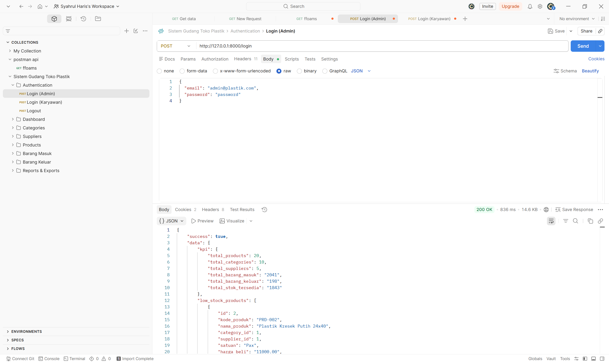
- Login Karyawan (POST)
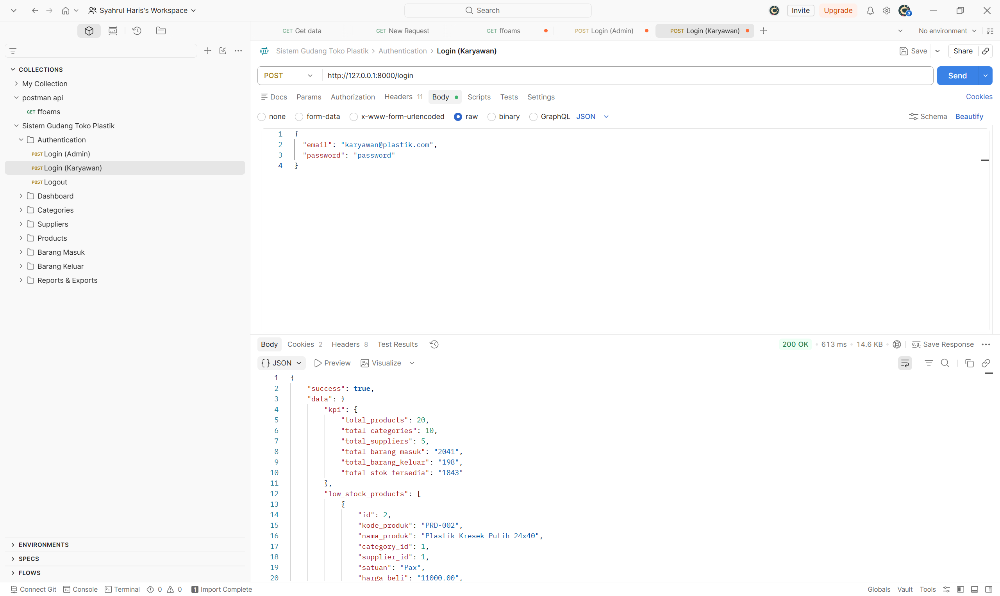
### 2. Kategori Produk
- Create Kategori Produk (POST)
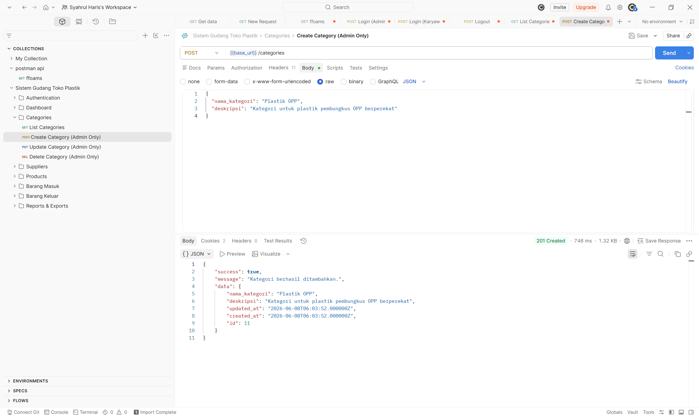
- Update Kategori Produk (PUT)
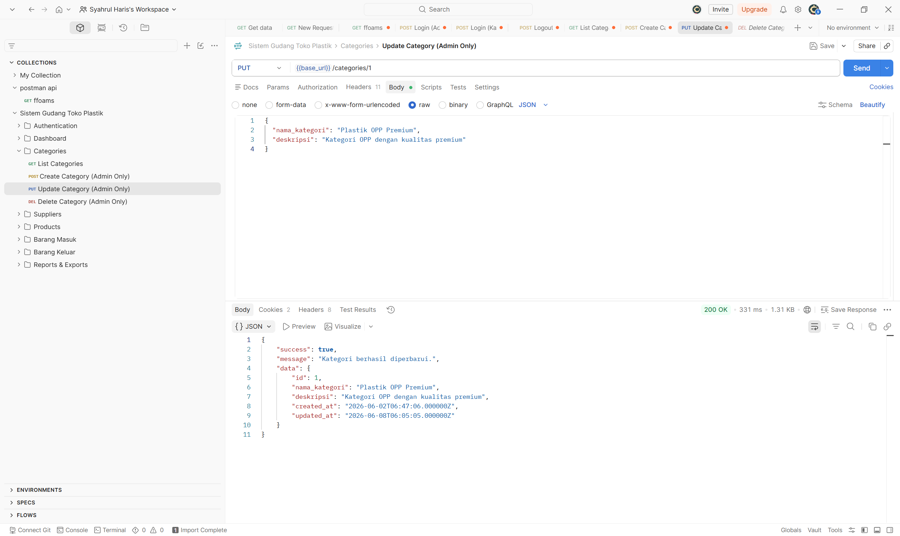
### 3. Supplier
- Create Supplier (POST)
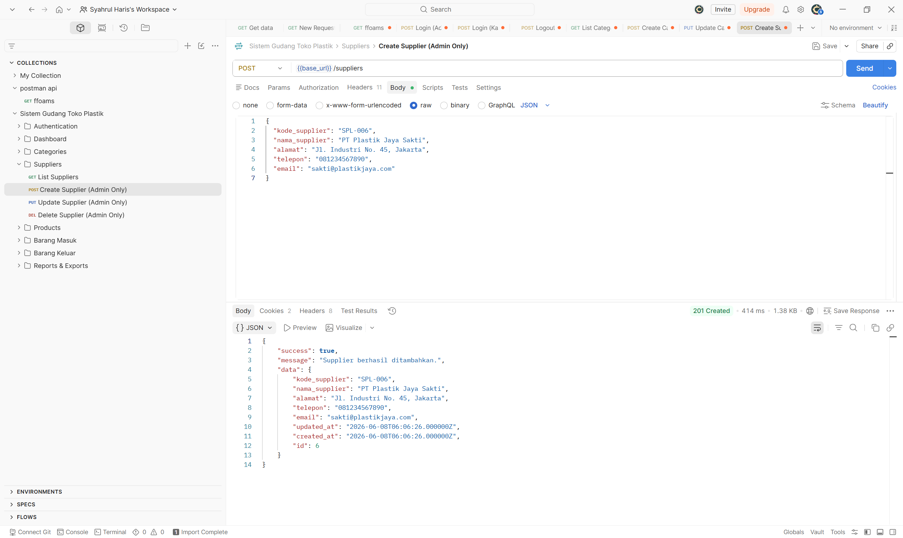
- Update Supplier (PUT)
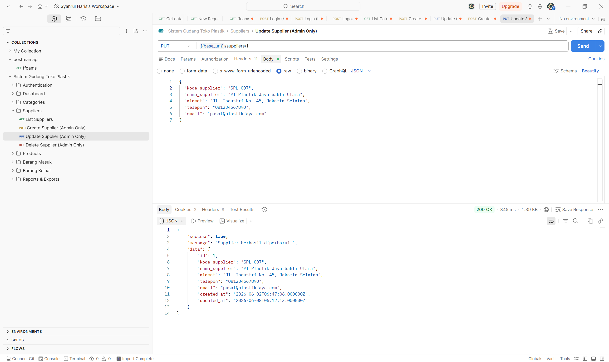
### 4. Produk
- Create Produk (POST)
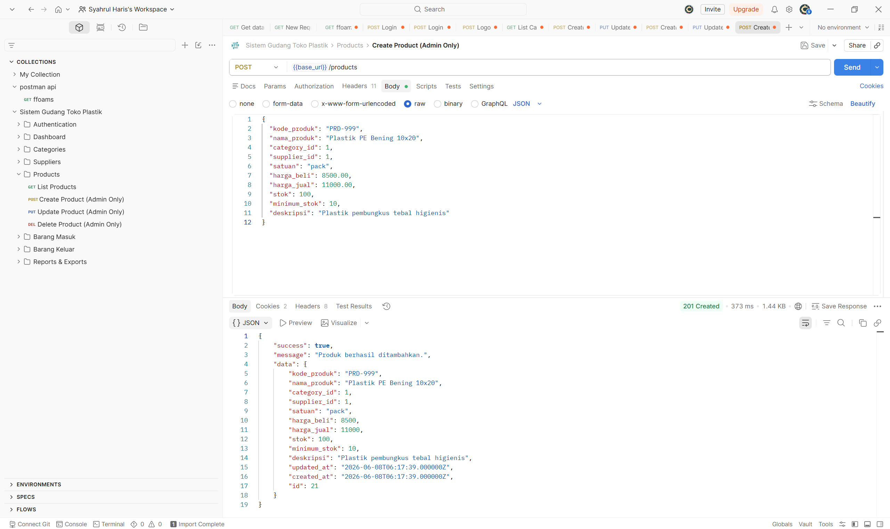
- Update Produk (PUT)
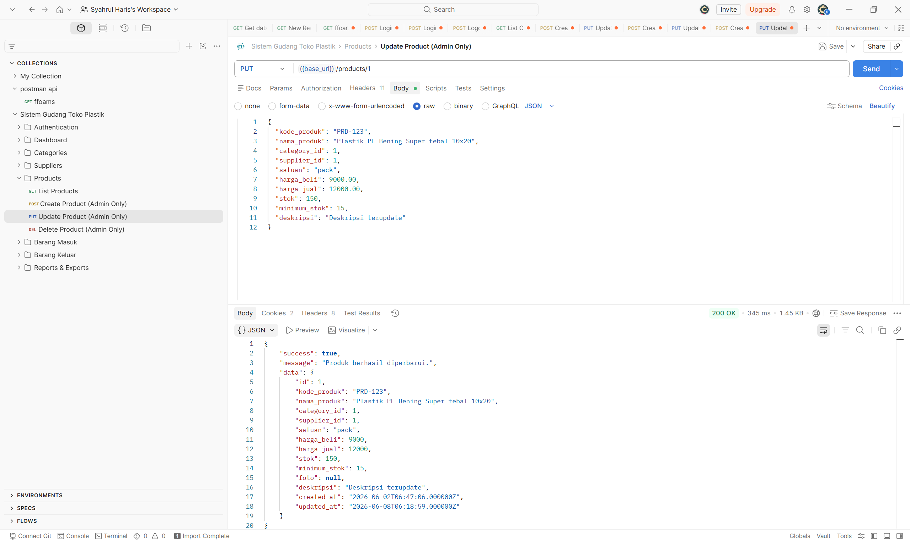
### 5. Barang Masuk
- Create Barang Masuk (POST)
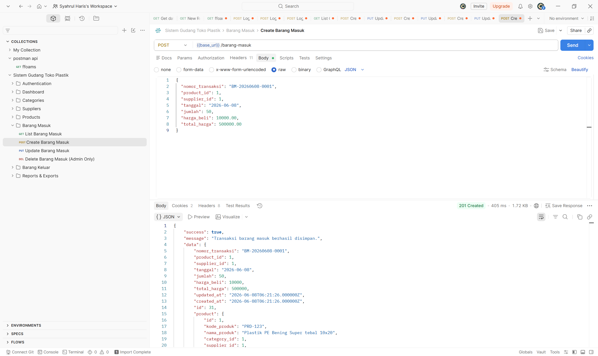
- Update Barang Masuk (PUT)
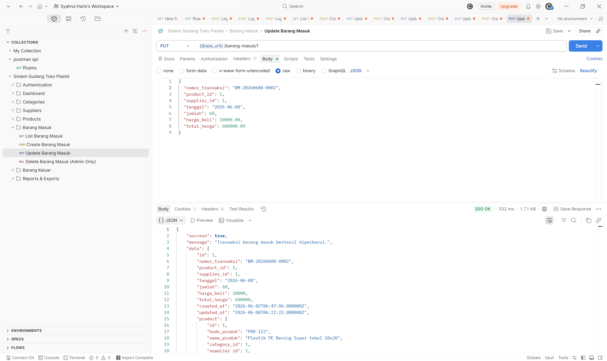
### 6. Barang Keluar
- Create Barang Keluar (POST)
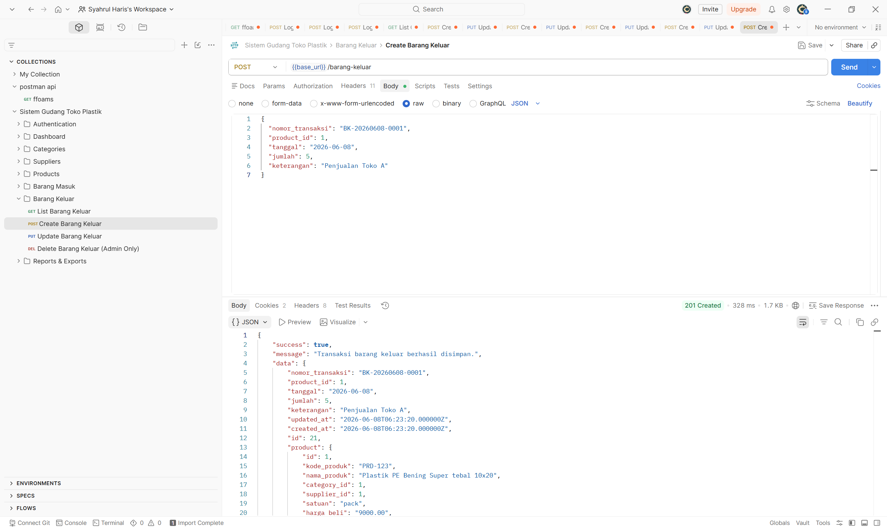
- Update Barang Keluar (PUT)
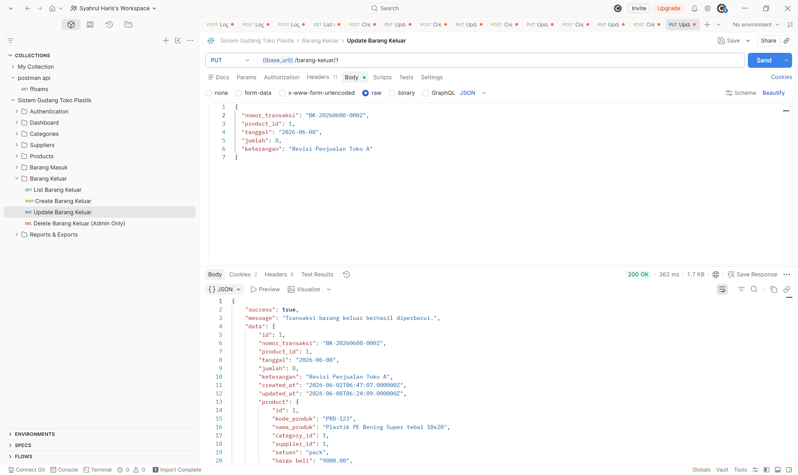

---

## 💻 Teknologi yang Digunakan
- **Backend:** PHP ^8.3 & Laravel ^13.8 (dengan Laravel Tinker)
- **Frontend:** Blade Templates & Tailwind CSS ^4.0 (dijalankan menggunakan Vite ^8.0 & `@tailwindcss/vite`)
- **Database:** MySQL / SQLite
- **Pengujian API:** Postman Collection

---

## 📋 Persyaratan Sistem
Pastikan perangkat Anda telah menginstal komponen berikut sebelum menjalankan aplikasi:
- **PHP** (Versi >= 8.3)
- **Composer**
- **Node.js & NPM**
- **Web Server** seperti Laragon (sangat disarankan di Windows), XAMPP, atau server lokal lainnya.
- **Git**

---

## 🚀 Instalasi & Cara Penggunaan

Ikuti langkah-langkah di bawah ini untuk menjalankan proyek secara lokal:

1. **Clone Repositori**
   ```bash
   git clone https://github.com/SyahrulHW/Sistem-Stok-Gudang-Toko-Plastik.git
   cd Sistem-Stok-Gudang-Toko-Plastik
   ```

2. **Jalankan Setup Otomatis**
   Proyek ini dilengkapi dengan skrip *setup* otomatis di `composer.json` yang akan melakukan instalasi dependensi backend, pembuatan file `.env`, pembuatan *application key*, migrasi database, instalasi modul NPM, serta build aset.
   ```bash
   composer setup
   ```

3. **Jalankan Seeder Database (Opsional)**
   Gunakan perintah berikut untuk mengisi database dengan data default (seperti data kategori, supplier, produk, transaksi, dan akun pengguna):
   ```bash
   php artisan db:seed
   ```

4. **Jalankan Server Pengembangan**
   Anda dapat menjalankan server Laravel dan compiler aset Vite secara bersamaan dengan menjalankan perintah berikut:
   ```bash
   composer dev
   ```
   Aplikasi akan berjalan secara lokal di [http://127.0.0.1:8000](http://127.0.0.1:8000).

---

## 🔑 Akun Uji Coba (Default Credentials)
Setelah menjalankan `php artisan db:seed`, Anda dapat masuk menggunakan salah satu dari akun uji coba berikut:

* **Akun Admin**
  - **Email:** `admin@plastik.com`
  - **Password:** `password`
  - **Hak Akses:** Penuh (CRUD Produk, Supplier, Kategori, Hapus Transaksi)

* **Akun Karyawan**
  - **Email:** `karyawan@plastik.com`
  - **Password:** `password`
  - **Hak Akses:** Terbatas (Melihat data, CRUD Transaksi Masuk/Keluar tanpa hak hapus transaksi, tidak dapat menambah/mengedit Master Data Produk/Supplier/Kategori)